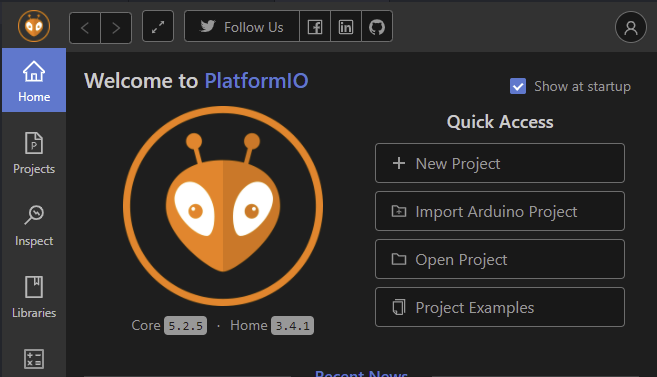

#   Toshiba Air Conditioner
---

## ChangeLog
              
* 01-04-2022 **migrate project to PlatformIO**
* 04-02-2022 **finally fixed websocket problem**
* 04-01-2022 **spiffs -> littlefs**
* 07-12-2021 **fixed query_sensors**
* 18-11-2021 **power consumption**
* 14-01-2021 **sensor info, to, tcj , ...**
* 04-01-2021 **pre-heat detection**
* 02-12-2020 **add min/max**
* 01-11-2020 **fix bmp180 not connected**
* 01-10-2020 **bmp180 support adds pressure**
* 05-09-2020 **fix temp, fix heat mode**
* 27-08-2020 **temperature graph**
* 15-07-2020 **Websockets**
* 01-06-2020 **initial version**

---

## Instructions:
  ### Hardware
  - R/W circuit (see [README.md](../../README.md))
  - DHT is connected to D3 (not necessary)
  - BMP180 connected to D1 (SCL) D2 (SDA) (not necessary)
  - Software serial rx on D7, tx on D8 Wemos mi
  ### Software
  
  **Prerequitites: [Install PlatformIO Extension for VSCode](https://platformio.org/install/ide?install=vscode)**
     
  
- Open :open_file_folder: project throught **PlatformIO**

 
 
  

- Upload :arrow_up: data directory with the task **Upload Filesystem Image** it with USB for the first time. Then,installed you can use OTA updates.

 
 

- You can use the serial monitor :computer:

 

---
## References: 
  
https://github.com/tttapa/ESP8266/
              
https://github.com/luisllamasbinaburo/ESP8266-Examples
              
https://diyprojects.io/esp8266-web-server-part-5-add-google-charts-gauges-and-charts/#.X0gBsIbtY5k